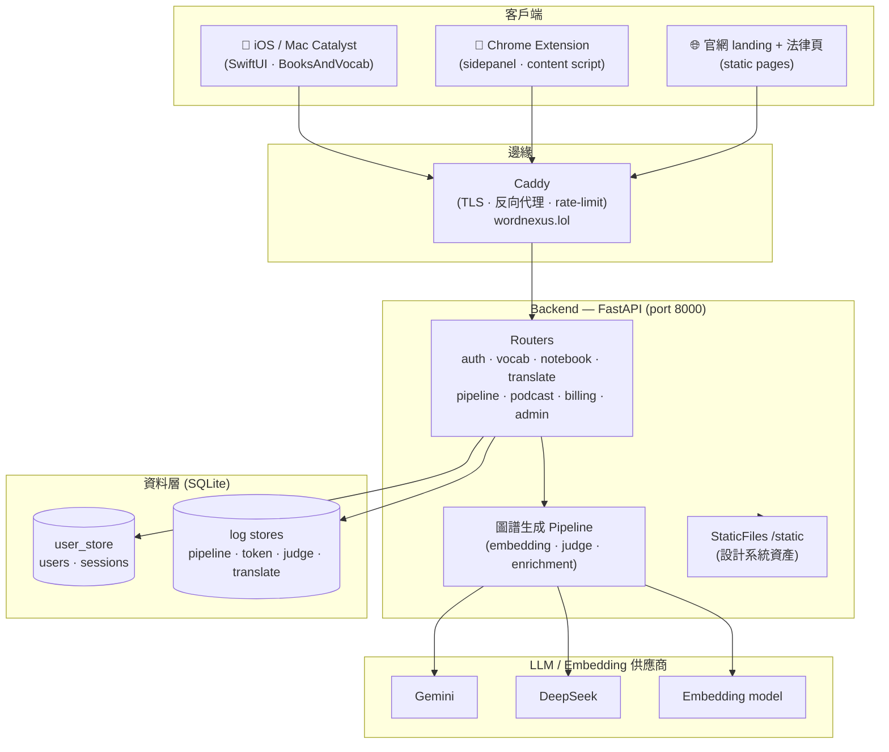
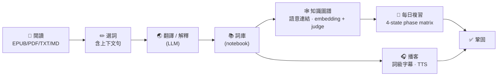

# KG — Knowledge Graph 英語詞彙學習

> 從一本書到一張知識圖譜。EPUB/PDF/TXT/MD reader 選詞 → 翻譯 → 詞庫 → 知識圖譜 → 每日複習 → 播客。

KG 是一套圍繞「**在閱讀情境中習得詞彙**」設計的學習系統。你在 reader 裡選一個字，它幫你翻譯、放進詞庫、和你已知的字建立語意連結（知識圖譜），再透過間隔複習與 AI 生成的播客把這些字鞏固下來。

Monorepo，單一 `.git`：iOS（SwiftUI）+ Backend（FastAPI）+ Chrome 擴充 + 設計系統 + ops。

---

## 系統架構



---

## 核心學習流

選一個字，到它被你記住的完整旅程：



---

## 倉庫結構

| 目錄 | 內容 |
|------|------|
| `ios/` | SwiftUI app（書架 / reader / 詞庫 / 圖譜 / 複習 / 播客 / 設定），支援 iPhone · iPad · Mac Catalyst |
| `backend/` | FastAPI 服務 — REST API、圖譜 pipeline、官網靜態頁、SQLite log stores |
| `chrome-extension/` | 瀏覽器選詞 → 翻譯 → 入庫的 sidepanel 擴充 |
| `design-system/` | 跨平台設計 token（iOS 為 SoT），生成 web `kg-tokens.css` / `kg-components.css` |
| `ops/` | 部署、健康檢查、i18n lint、doc lint 等運維腳本 |
| `lab/` | 播客生成 pipeline、Claude Code Gateway 等實驗工具 |
| `docs/` | 工程文檔（reference / sop / policy / runbook，含 doc-as-code 契約） |

---

## 技術棧

- **iOS**：Swift / SwiftUI，Mac Catalyst（macOS 15+ 原生視窗 + ⌘ 快捷鍵），Sentry crash reporting
- **Backend**：Python / FastAPI，SQLite，uv 管理依賴與 venv
- **AI**：Gemini / DeepSeek（per-call-type 路由），embedding-based 語意連結 + LLM judge 把關
- **基礎設施**：AWS Lightsail + Docker，Caddy（TLS / 反向代理），域名 `wordnexus.lol`

---

## 開發

```bash
# Backend（一律用 uv，勿直接 python）
cd backend
uv run pytest                  # 跑測試
uv run uvicorn kg.api:app --reload --port 8000

# iOS — 唯一合法編譯入口（多 worktree 安全鎖）
./ops/ios_build.sh

# 設計系統 token 重新生成
npm run build                  # tokens.json → DesignTokens.swift / web CSS
```

> 詳細工程約定、文檔路由與運維 SOP 見 [`CLAUDE.md`](CLAUDE.md) 與 [`docs/`](docs/)。

---

## 功能亮點

- **多格式閱讀器**：EPUB / PDF / TXT / MD 匯入，沉浸閱讀，選詞即翻譯
- **知識圖譜**：embedding 找候選 → LLM judge 確認語意連結，可隱藏/還原並雙向同步
- **每日複習**：間隔複習與複習指標追蹤
- **AI 播客**：把一本書轉成多集播客腳本 + TTS 音訊 + 詞級 SRT 字幕，播放中可長按查詞
- **跨平台同步**：iOS ↔ backend 多帳戶隔離、incremental sync、樂觀更新
- **官網**：消費 iOS 設計系統的 landing 首頁 + 隱私/條款/支援/使用指南頁
